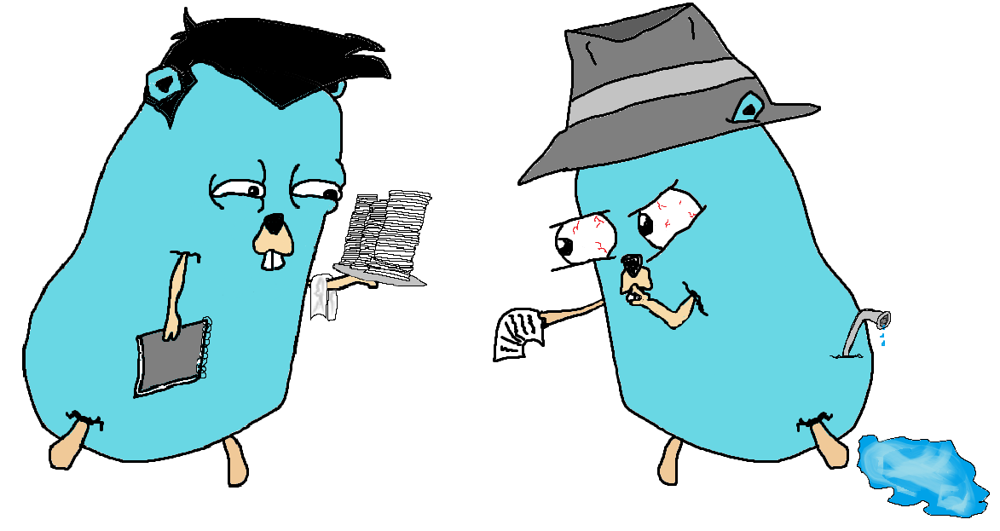
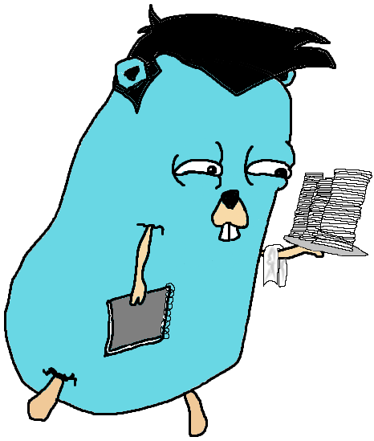
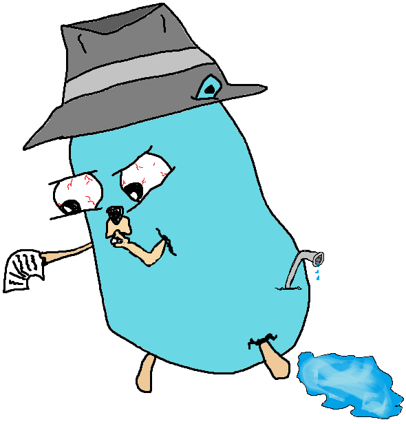

<h2 align="center">Goshh</h3>
  
<!-- LOGO -->
 

  

  A Go message and file sharing service

<!-- ABOUT -->
# About
I was looking for a secret/OPT sharing service in [libhunt](https://selfhosted.libhunt.com/), [awesome-selfhosted](https://github.com/awesome-selfhosted/awesome-selfhosted#communication---custom-communication-systems), and [awesome-privacy](https://github.com/pluja/awesome-privacy#pastebin-and-secret-sharing).  
I saw a few projects that were interesting like; [ots](https://github.com/Luzifer/ots) and [privatebin](https://github.com/PrivateBin/PrivateBin), but I dont like javascropt or php.  
The others I saw were way too complex for me to build and understand, so I opted to make something for myself.  

### Links to the repositories

  <a href="https://github.com/5ur/Goshh-Server">
  
   <a href="https://github.com/5ur/Goshh-Client">
  

### Built With
[![Go][Go]][Go-url] [![Powershell][Powershell]][Powershell-url] [![Vim][Vim]][Vim-url] [![Exchange][StackExchange]][StackExchange-url] [![Overflow][StackOverflow]][StackOverflow-url] [![Windows][Windows]][Windows-url]

<!-- ROADMAP -->
# Roadmap
 - [x] Set the random :id generation to a rune/charset because pluses break it as well
 - [x] Clean up the "\"\n" shit at the end of the message contents.
 - [x] Add the QR code as a flag or config file option.
 - [x] Add file upload
 - [x] Add a manifest and branding to the scripts.
 - [] Create front-end for a more mobile friendly experience
 - [] Add automatic clear config option for the QR code print-out
 - [] _Maybe:_ Increase the QR buffer
 - [] Add client-side encryption
 - [] Add an openapi documentation html page as the root of the server

<!-- LICENSE -->
## License
Distributed under the MIT License. See `LICENSE` for more information.  
I chose MIT, because it seems ok for the project.  
In essence, feel free to clone, copy, edit, distribute, tell your friends you made this on your own, and/or whatever you want to.  
I made this for myself - I have the script, so I don't care if someone else is using it, making "money" or getting street cred from it.  
I know for a fact that if it wasn't the go docs, stack*, other go projects, and grep.app I wouldn't have been able to make that, so It's not even mine when thinking about it. I just placed the lines one beneath the other.   
Consider this set of files as your property.

<!-- CONTACT -->
## Contact
You can send me a message on github.
Don't know what you would message me for, but you can do it.  
Maybe you are a rich motherfucker looking at random git repos and you'll give me money. I wouldn't mind getting money.

<!-- ACKNOWLEDGMENTS -->
## Acknowledgments

* [Guy who made the OTS project](https://github.com/Luzifer/ots) - Gave me the idea in the first place
* [Guy who made this README.md emplate](https://github.com/othneildrew/Best-README-Template) - Gave me the template which you are reading right now
* [MS Paint](https://apps.microsoft.com/store/detail/paint/9PCFS5B6T72H) - Used it to draw the logos
* [Pixlr](https://pixlr.com/x/) - Used it to make the logos transparent
* [//Grep.app](https://grep.app/) - Found some nice examples in there.
* [ChatGPT](https://openai.com/blog/chatgpt) - Retarded, slow, confusing and wrong, but gave me some **really** good tips when when I just started asking it for questions about logic rather than making it write code.

(<a href="#readme-top">back to top</a>)

<!-- MARKDOWN LINKS & IMAGES -->
[Go]: https://img.shields.io/badge/Go-00ADD8?style=for-the-badge&logo=go&logoColor=white
[Go-url]: https://go.dev/doc/

[Powershell]: https://img.shields.io/badge/powershell-5391FE?style=for-the-badge&logo=powershell&logoColor=white
[Powershell-url]: https://github.com/PowerShell/PowerShell

[Vim]: https://img.shields.io/badge/NeoVim-%2357A143.svg?&style=for-the-badge&logo=neovim&logoColor=white
[Vim-url]: https://github.com/AstroNvim/AstroNvim

[StackExchange]: https://img.shields.io/badge/StackExchange-%23ffffff.svg?&style=for-the-badge&logo=StackExchange&logoColor=white
[StackExchange-url]: https://stackexchange.com/

[StackOverflow]: https://img.shields.io/badge/Stack_Overflow-FE7A16?style=for-the-badge&logo=stack-overflow&logoColor=white
[StackOverflow-url]: https://stackoverflow.com/

[Windows]: https://img.shields.io/badge/Windows-0078D6?style=for-the-badge&logo=windows&logoColor=white
[Windows-url]: https://www.microsoft.com/en-us/windows?r=1

[linkedin-shield]: https://img.shields.io/badge/-LinkedIn-black.svg?style=for-the-badge&logo=linkedin&colorB=555
[linkedin-url]: https://linkedin.com/in/othneildrew

