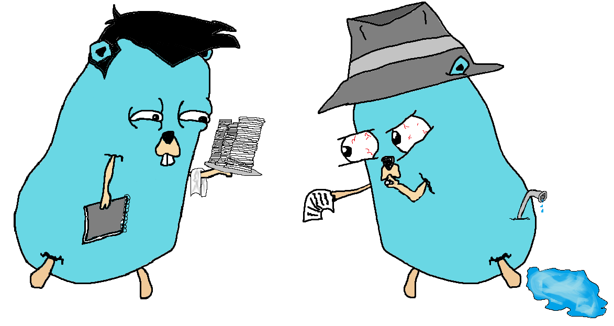

<a name="readme-top"></a>
<h2 align="center">Goshh</h3>
  
<!-- LOGO -->
<br />
<div align="center">
  <a href="https://github.com/othneildrew/Best-README-Template">
    
  </a>

<p align="center">
  A Go message and file sharing service
  <br />
  <a href="https://github.com/othneildrew/Best-README-Template"><strong>Wiki»</strong></a>
</div>

<!-- TOC -->
<details>
  <summary>Table of Contents</summary>
  <ol>
    <li>
      <a href="#about-the-project">About</a>
      <ul>
        <li><a href="#built-with">Built With</a></li>
      </ul>
    </li>
    <li>
      <a href="#getting-started">Getting Started</a>
      <ul>
        <li><a href="#prerequisites">Prerequisites</a></li>
        <li><a href="#installation">Installation</a></li>
      </ul>
    </li>
    <li><a href="#usage">Usage</a></li>
    <li><a href="#roadmap">Roadmap</a></li>
    <li><a href="#contributing">Contributing</a></li>
    <li><a href="#license">License</a></li>
    <li><a href="#contact">Contact</a></li>
    <li><a href="#acknowledgments">Acknowledgments</a></li>
  </ol>
</details>


<!-- ABOUT -->
## About
I was looking for a secret/OPT sharing service in [libhunt](https://selfhosted.libhunt.com/), [awesome-selfhosted](https://github.com/awesome-selfhosted/awesome-selfhosted#communication---custom-communication-systems), and [awesome-privacy](https://github.com/pluja/awesome-privacy#pastebin-and-secret-sharing).  
I saw a few projects that were interesting like; [ots](https://github.com/Luzifer/ots) and [privatebin](https://github.com/PrivateBin/PrivateBin), but I dont like javascropt or php.  
The others I saw were way too complex for me to build and understand, so I opted to make something for myself.

### Built With
[![Go][Go]][Go-url] [![Powershell][Powershell]][Powershell-url] [![Vim][Vim]][Vim-url] [![Exchange][StackExchange]][StackExchange-url] [![Overflow][StackOverflow]][StackOverflow-url] [![Windows][Windows]][Windows-url]

<!-- GETTING STARTED -->
## Getting Started

This is an example of how you may give instructions on setting up your project locally.
To get a local copy up and running follow these simple example steps.

### Prerequisites

This is an example of how to list things you need to use the software and how to install them.
* npm
  ```sh
  npm install npm@latest -g
  ```

### Installation

_Below is an example of how you can instruct your audience on installing and setting up your app. This template doesn't rely on any external dependencies or services._

1. Get a free API Key at [https://example.com](https://example.com)
2. Clone the repo
   ```sh
   git clone https://github.com/your_username_/Project-Name.git
   ```
3. Install NPM packages
   ```sh
   npm install
   ```
4. Enter your API in `config.js`
   ```js
   const API_KEY = 'ENTER YOUR API';
   ```

<p align="right">(<a href="#readme-top">back to top</a>)</p>


<!-- USAGE EXAMPLES -->
## Usage

Use this space to show useful examples of how a project can be used. Additional screenshots, code examples and demos work well in this space. You may also link to more resources.

_For more examples, please refer to the [Documentation](https://example.com)_

<p align="right">(<a href="#readme-top">back to top</a>)</p>


<!-- ROADMAP -->
## Roadmap
 - [x] Set the random :id generation to a rune/charset because pluses break it as well
 - [x] Clean up the "\"\n" shit at the end of the message contents.
 - [x] Add the QR code as a flag or config file option.
 - [x] Add file upload
 - [] Add pushover/gotify/azure notification/other push notification support in the Goshh binary or the server depending on if something is passed in the json body?
 - [x] Add a manifest and branding to the scripts.
 - [] Use github actions to compile the binaries
 - [] Add an openapi documentation html page as the root of the server

<!-- CONTRIBUTING -->
## Contributing

Contributions are what make the open source community such an amazing place to learn, inspire, and create. Any contributions you make are **greatly appreciated**.

If you have a suggestion that would make this better, please fork the repo and create a pull request. You can also simply open an issue with the tag "enhancement".
Don't forget to give the project a star! Thanks again!

1. Fork the Project
2. Create your Feature Branch (`git checkout -b feature/AmazingFeature`)
3. Commit your Changes (`git commit -m 'Add some AmazingFeature'`)
4. Push to the Branch (`git push origin feature/AmazingFeature`)
5. Open a Pull Request

<p align="right">(<a href="#readme-top">back to top</a>)</p>


<!-- LICENSE -->
## License
Distributed under the MIT License. See `LICENSE` for more information.


<!-- CONTACT -->
## Contact
Petar - [@placeholder](https://example.com) - 5150@penev.xyz


<!-- ACKNOWLEDGMENTS -->
## Acknowledgments

* [Guy who made the OTS project](https://github.com/Luzifer/ots) - Gave me the idea
* [Guy who made this README.md emplate](https://github.com/othneildrew/Best-README-Template) - Gave me the template which you are reading right now
* [MS Paint](https://apps.microsoft.com/store/detail/paint/9PCFS5B6T72H) - Used it to draw the logos
* [Pixlr](https://pixlr.com/x/) - Used it to make the logos transparent
* [ChatGPT](https://openai.com/blog/chatgpt) - Retarded, slow, confusing and wrong, but gave me some **really** good tips when when I just started asking it for questions about logic rather than making it write code.

<p align="right">(<a href="#readme-top">back to top</a>)</p>


<!-- MARKDOWN LINKS & IMAGES -->
[product-screenshot]: logo/logo.png
[Go]: https://img.shields.io/badge/Go-00ADD8?style=for-the-badge&logo=go&logoColor=white
[Go-url]: https://go.dev/doc/

[Powershell]: https://img.shields.io/badge/powershell-5391FE?style=for-the-badge&logo=powershell&logoColor=white
[Powershell-url]: https://github.com/PowerShell/PowerShell

[Vim]: https://img.shields.io/badge/NeoVim-%2357A143.svg?&style=for-the-badge&logo=neovim&logoColor=white
[Vim-url]: https://github.com/AstroNvim/AstroNvim

[StackExchange]: https://img.shields.io/badge/StackExchange-%23ffffff.svg?&style=for-the-badge&logo=StackExchange&logoColor=white
[StackExchange-url]: https://stackexchange.com/

[StackOverflow]: https://img.shields.io/badge/Stack_Overflow-FE7A16?style=for-the-badge&logo=stack-overflow&logoColor=white
[StackOverflow-url]: https://stackoverflow.com/

[Windows]: https://img.shields.io/badge/Windows-0078D6?style=for-the-badge&logo=windows&logoColor=white
[Windows-url]: https://www.microsoft.com/en-us/windows?r=1

[linkedin-shield]: https://img.shields.io/badge/-LinkedIn-black.svg?style=for-the-badge&logo=linkedin&colorB=555
[linkedin-url]: https://linkedin.com/in/othneildrew

